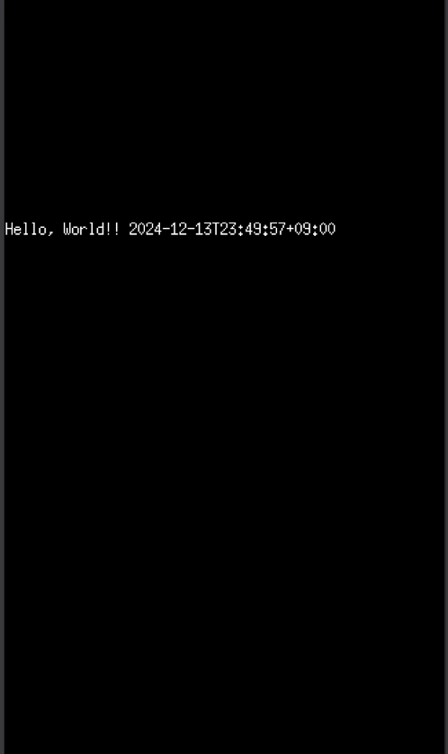

# ebitengine入門した

ゲーム画面のWASMとAPIを通信するようにしてみた。
最小構成のはず。

<https://ebitengine.org/ja/documents/install.html?os=linux>
<https://ebitengine.org/ja/documents/webassembly.html>

上のドキュメントの通りに

ルートに、

HTML（index.html）とかjsファイルを用意してゲームをコンパイルすると、

`make server`で`localhost:3000`でゲームとAPIを提供するサーバを立てられる。

- `cmd/game/main.go`はゲームのエントリーポイント。
- `cmd/server/main.go`はサーバー。

## 成果物



画面は、1秒に10回、サーバーから描画するテキストを受け取っている。

## 実装

```golang
// cmd/game/main.go
func (g *Game) Update() error {
    resp, _ := http.Get("/api/echo")
    defer resp.Body.Close()
    var buf bytes.Buffer
    buf.ReadFrom(resp.Body)
    g.word = buf.String()
    return nil
}
func (g *Game) Draw(screen *ebiten.Image) {
    ebitenutil.DebugPrint(screen, g.word)
}

// cmd/server/main.go
api.HandleFunc("/api/echo", func(w http.ResponseWriter, r *http.Request) {
    w.Write([]byte(fmt.Sprintf("Hello, World!! %s", time.Now().Format(time.RFC3339))))
    w.WriteHeader(http.StatusOK)
})
mux.Handle("/", http.FileServer(http.Dir(".")))
mux.Handle("/api/", api)
http.ListenAndServe(":3000", mux)
```

デプロイするときはembedしてもいいかもね。

## 背景

作っているゲームで使おうかなとか。
